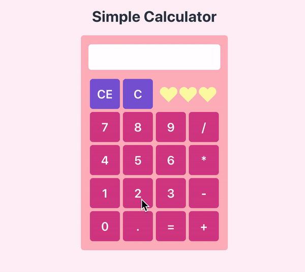

# React Calculator
Simple calculator made using React and Chakra UI.

# Demo   

# Usage
To run the project locally in development mode:
* Clone the repo with  `git clone https://github.com/briannamcdonald/react-calculator.git`
* `cd react-calculator`
* Run  `npm install`  to install dependencies
* Run  `npm start`
* Open  `localhost:3000`  in your browser
